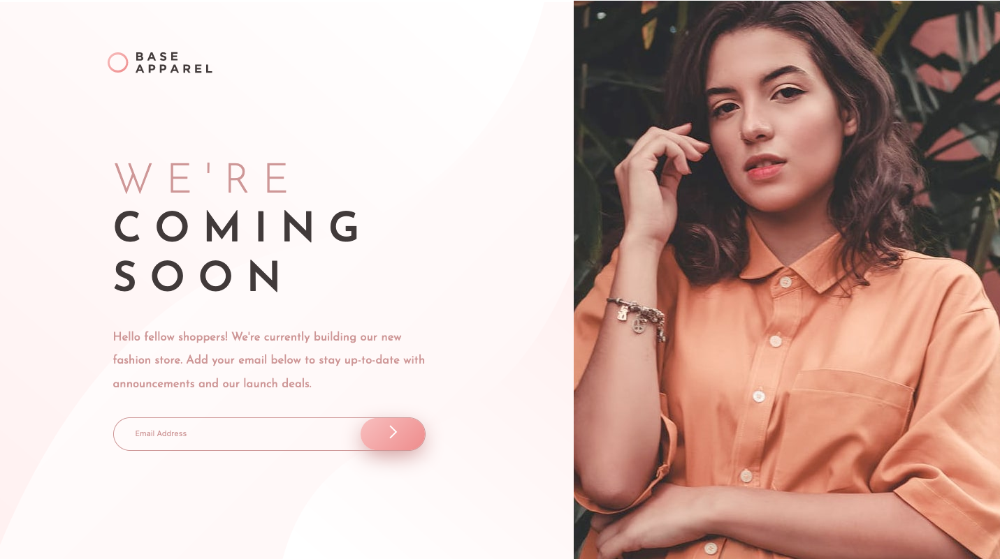

# Frontend Mentor - Base Apparel coming soon page
## Table of contents

- [Overview](#overview)
  - [The challenge](#the-challenge)
  - [Screenshot](#screenshot)
- [My process](#my-process)
  - [Built with](#built-with)
  - [What I learned](#what-i-learned)
- [Author](#author)

## Overview

### The challenge

Users should be able to:

- View the optimal layout depending on their device's screen size

### Screenshot

### Links

- Solution URL: [Code](https://github.com/cleunggit/base-apparel-coming-soon-master)
- Live Site URL: [Preview](https://cleunggit.github.io/base-apparel-coming-soon-master)

## My process

### Built with

- SCSS
- BEM
- Flexbox

### What I learned
- how to use SCSS
- organized code using BEM methodology

## Author

- Frontend Mentor - [@cleunggit](https://www.frontendmentor.io/profile/cleunggit)
- Twitter - [@CodeLikeChris](https://www.twitter.com/CodeLikeChris)